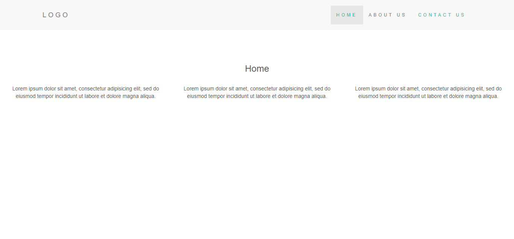

# Build Simple Website with NodeJS, Express & EJS view engine

## Document
* Clone this repo: ``` git clone https://github.com/bhanushalimahesh3/node-website.git ```
* Install dependencies using npm javascript package manager: ``` npm install ```
* Start node server with [nodemon](https://nodemon.io/): ``` nodemon start ```
* Tune to url: ``` http://localhost:3000 ```

All routes are defined in routes/index.js file, static view pages are in views folder. I have implemented partials concept to avoid code redundancy in html using EJS view engine. Css and Javascript files are stored in public folder. 


## Screenshot

